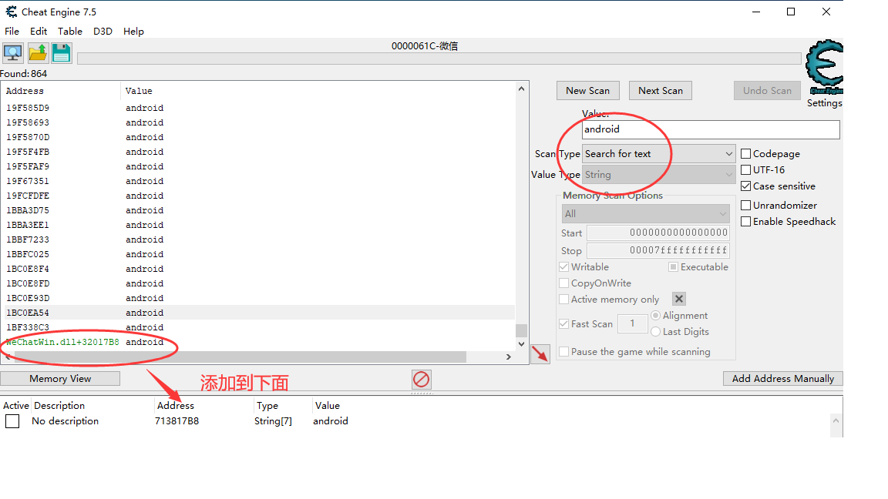
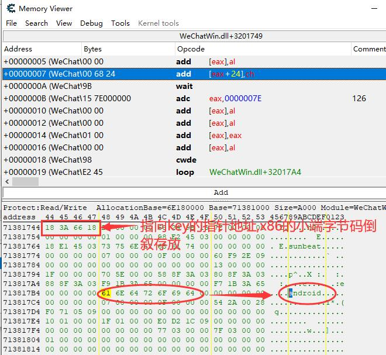
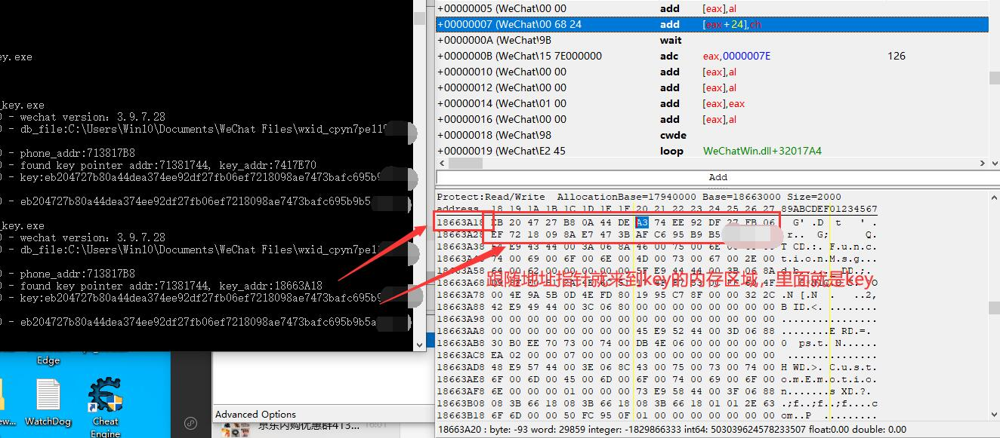

# search_wechat_key
## 本程序用来搜索微信数据库的密钥key信息   
  
**不要用于非法用途！**  
**不要用于非法用途！**  
**不要用于非法用途！**  

## 原理
一般情况下，key 要在运行的微信进程内存中拿到，内存偏移在每个版本都不一样，大部分工具是对每个版本维护一套偏移，但是当出现新版本的时候都要重新找偏移。
其实，除了这个方法外，还有一个更通用的方法就是内存暴力搜索找到能用于解密的密钥位置，当然如果对进程全部内存扫一遍肯定不行，所以项目里用下面这种方式缩小密钥内存范围加快扫描速度：
1. 微信登录设备类型基本只有 iphone、android，在内存中先搜到设备类型所在内存，key 就在它的前面，向前搜就行；  
2. key 的内存地址和登录设备类型在大部分版本是16 字节对齐的，但也有非16字节对齐，这里用的是每次向前 1 字节方式，避免遇到非对齐情况；  
每次读32字节，然后判断读取的是不是微信sqlite的数据库密钥。   密钥找到后，可以为后续读取微信聊天记录做准备。   

## 已测试版本列表

其它未测试版本不代表不能用，这个列表只是我本地有过的环境。
- 3.9.7.29 （64位版）
- 3.9.7.28 （32位版）
  
## 用法类似：
```
C:\Users\Win10\Desktop\pc_wechat\dist>search_wecaht_key.exe  
2023-10-26 13:52:01,281 - search_wecaht_key.py- INFO - wechat version：3.9.7.28  
2023-10-26 13:52:01,583 - search_wecaht_key.py- INFO - db_file:C:\Users\Win10\Documents\WeChat Files\wxid_cpyn7pe119rxxx\Msg\Misc.db  
2023-10-26 13:52:01,699 - search_wecaht_key.py- INFO - phone_addr:713817B8  
2023-10-26 13:52:01,888 - search_wecaht_key.py- INFO - found key pointer addr:71381744, key_addr:7417E70  
2023-10-26 13:52:01,888 - search_wecaht_key.py- INFO - key:eb204727b80a44dea374ee92df27fb06ef7218098ae7473bafc695b9b5a9xxxx  
2023-10-26 13:52:01,888 - search_wecaht_key.py- INFO - eb204727b80a44dea374ee92df27fb06ef7218098ae7473bafc695b9b5a9xxxx  
 ```

目前测试的版本
本程序参考了：[https://github.com/0xlane/wechat-dump-rs](https://github.com/0xlane/wechat-dump-rs)的代码实现。  

## 如何手动寻找偏移
  
使用 CheatEngine 在内存中搜索找到字符串android（我的手机是安卓，如果是iphone的，用iphone搜），必须是在 `WeChatWin.dll` 内存范围内
  
  
  
  
  


